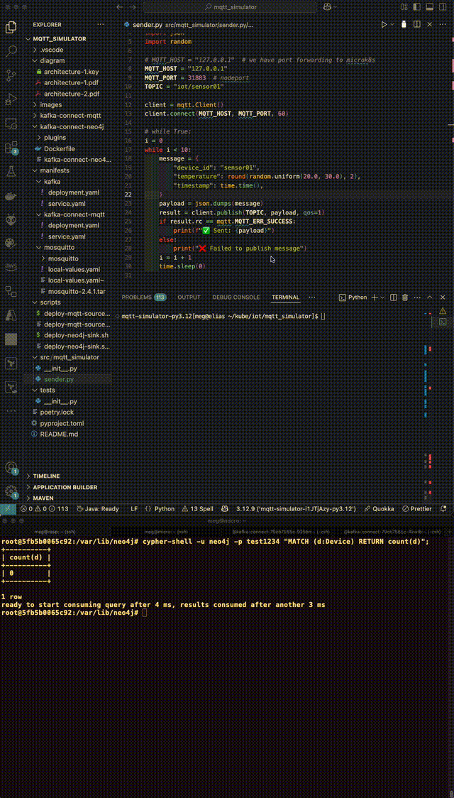
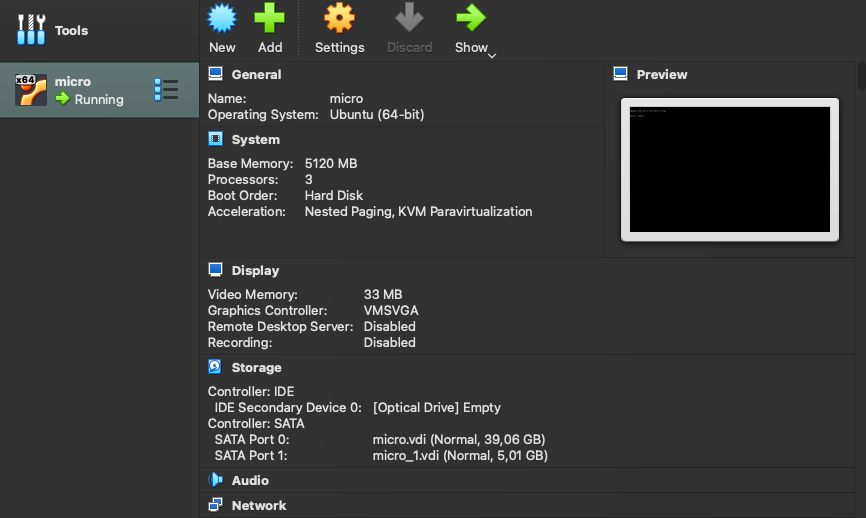
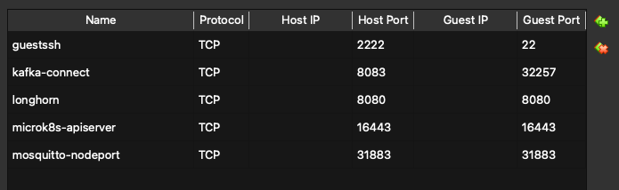
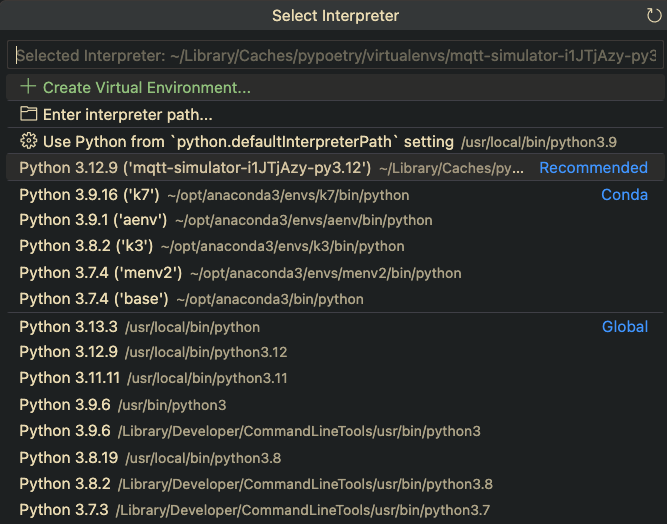
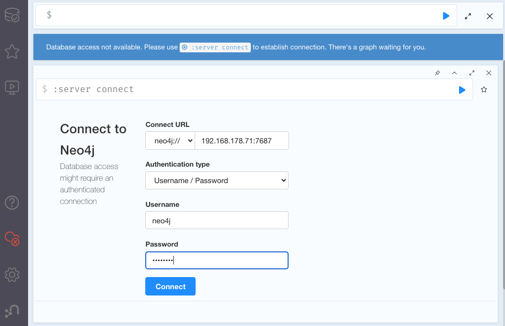
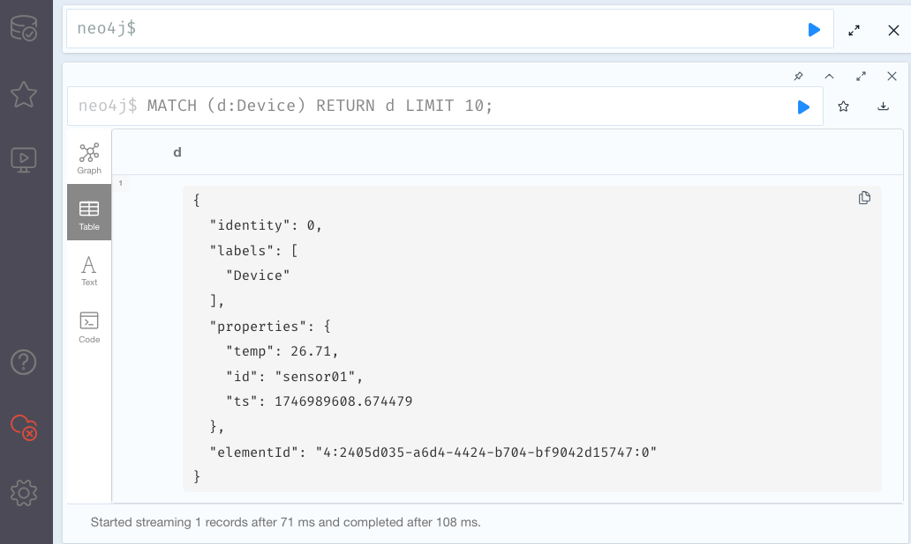

# IIoT device -> neo4j Streaming Pipeline - PoC

## Result





## Motivation

Connect an IIoT device to neo4j on a cloud. 

* Data from IIoT device should be uploaded to neo4j database.
* The pipeline must be robust against network outage. 

The ends of the pipeline are given as boarder condition, it has to start 
from an IoT device, and has to end in neo4j. The in-betweens are open. 

In a large picture, we have two options: 
* trigger an upload whenever the device publish the data
* stream data

In this repo we will see if/how the second option, streaming data from IoT,
would work. 

Note: I used a lot of help from **ChatGPT** for this experiments. 
I call my ChatGPT 'Charlie-san I'.

### Consideration 1 : why kafka?

- Starting from the end, neo4j offers kafka connector for streaming. 
[neo4j data import options](https://neo4j.com/docs/getting-started/data-import/)
  
Kafka has various features for data streaming, but two are particularly interesting for our case.
- Kafka has a queue. Therefore robust against network outage. 
- Kafka works as a cluster. It eliminates single point of failure.  

### Consideration 2 : kafka connector

The problem of using kafka is that kafka does not read MQTT message directly. 
Therefore connecting IoT device to kafka directly, or connecting a MQTT broker like mosquitto
directly to kafka, is not an option. We need a connector in between. 

Kafka connector that is used for connecting kafka to neo4j works as a MQTT -> kafka connector
as well. That is just a matter of adding a plugin to kafka connector. 

## Architecture

The components are following. 

 

1. IoT device simulator
2. mosquitto
3. MQTT source connector ("MQTT connector" in the architecture diagram)
4. kafka (= kafka broker)
5. neo4j sink connector ("neo4j connector" in the architecture diagram)
6. neo4j

* "1" runs on my macbook directly.
* "2" runs on a kubernetes cluster that is running on VM inside macbook.
* "3" and "5" are running together in one pod "kafka connect" (=kafka connector)
* "4" runs on the kubernetes cluster as well
* "6" is running on a docker container that is on Raspberry pi. 

---
## Overview

###  Infrastructure

1. Set up VM 
2. Set up mirok8s (= kubernetes cluster)
3. Deploy mosquitto on microk8s
4. Write IoT device simulator with python
5. Deploy kafka connector 
6. Plug in MQTT source connector
7. Deploy kafka
8. Start neo4j container 
9. Plug in neo4j sink connector

Note: I have longhorn already running on microk8s so that providing 
a storage to mosquitto was simple. Please see [longhorn]https://github.com/megnergit/Microk8s_PostgreSQL_M1 to know how to deploy longhorn with helm. 

###  Experiments 

10. connection test
11. intermittent inputs  (TBD)
12. network outage (TBD)

---

## 1. Set up VM for the experiment

We will recycle our usual Ubuntu server created by VirtualBox. 
See [another repo](https://github.com/megnergit/Microk8s_PostgreSQL_M1) of mine
to know how to start a VirtualBox machine. 

During the experiments I encountered many times resource shortage, i.e., lack of 
CPU, RAM and storage for VM. I used all means to press the use of resource (will be discussed later), but kafka uses quite a large computing resources even for a single node setup. 

The following is bare minimum resource that VM will require to perform the experiment. 

* Core: 3
* RAM : 5Gib
* Storage: 40Gib

 

We will use NAT

 

We will use 'NAT' here. 
Make sure 'NAT' and 'NAT network' are different for VirtualBox machines. 
VM with NAT network can reach out the **Internet** by default, but 
**host to VM** connection is disabled. 

In order to make the VM accessible from host via ssh and `kubectl`, we will 
set up  port forwarding.

On **host** (or VitrualBox Manager UI)
```sh
VBoxManage modifyvm "micro" --natpf1 "guestssh,tcp,,2222,,22"
VBoxManage modifyvm "micro" --natpf1 "apiserver,tcp,,16443,,6443"
...
```
... or, do it on GUI. 

 

| service              | protocol   | port (host)    | port (VM)      |
|----------------------|------------|----------------|----------------|
| guestssh             | TCP        | 2222           | 22             |
| kafka-connect        | TCP        | 8083           | 32257          |
| longhorn             | TCP        | 8080           | 8080           |
| microk8s-apiserver   | TCP        | 16443          | 16443          |
| mosquitto-nodeport   | TCP        | 31883          | 31883          |


−--

## 2. Set up `microk8s` cluster

Please see [how to start microk8s](https://github.com/megnergit/Microk8s_PostgreSQL_M1) 
to start `microk8s` cluster on the VM that we have just started.


We need to enable a couple of addons. 

On VM. 
```sh
$ microk8s status
microk8s is running
high-availability: no
  datastore master nodes: 127.0.0.1:19001
  datastore standby nodes: none
addons:
  enabled:
    dns                  # (core) CoreDNS
    ha-cluster           # (core) Configure high availability on the current node
    helm                 # (core) Helm - the package manager for Kubernetes
    helm3                # (core) Helm 3 - the package manager for Kubernetes
    hostpath-storage     # (core) Storage class; allocates storage from host directory
    metrics-server       # (core) K8s Metrics Server for API access to service metrics
    storage              # (core) Alias to hostpath-storage add-on, deprecated
  disabled:
    cert-manager         # (core) Cloud native certificate management
    cis-hardening        # (core) Apply CIS K8s hardening
....
```
We will enable them one by one like this
```sh
$ microk8s enable helm 
$ microk8s enable helm3
$ microk8s enable hostpath-storage
... 
```
Check it.

```sh
$ microk8s status
```
You will need helm also installed on your laptop. 


---
3. Deploy mosquitto on microk8s

In the following ```k``` means ```kubectl```.

```sh
$ cat ~/.zshrc | grep alias | grep kubectl
alias k="kubectl"
```

Check if microk8s (= a kind of kubernetes cluster. Single node.) is alive.

On host (= your laptop)
```
$ k get no
NAME    STATUS   ROLES    AGE   VERSION
micro   Ready    <none>   85d   v1.31.7
```
We are communicating with VM via port forwarding. 

First create a namespace in which we will use for whole this experiment. 

```sh
k create ns iot-lab
```

Check it. 

```
k get ns
```

Switch to the namespace iot-lab.

```
k config set-context --current --namespace iot-lab
```

Then we will install mosquitto MQTT message broker written by the company Eclipse. 

We could not somehow reach the helm chart of mosquitto at [eclipse](https://eclipse.org/mosquitto/charts). We will use the one maintained by t3n instead. 
Detail of the image is [here](http://artifacthub.io/packages/helm/t3n/mosquitto)

Add repo and check it. This is on local  (= your laptop)
```
helm repo add t3n https://storage.googleapis.com/t3n-helm-charts
helm repo list
helm repo update
```

To install mosquitto. 
We found this set of environment variables to set up in a hard way. 

```sh
$ helm install mosquitto t3n/mosquitto \
  --set service.type=NodePort \
  --set ports.mqtt.nodePort=31883 \
  --set ports.ws.enabled=true \
  --set ports.ws.port=9090 \
  --set ports.ws.nodePort=30409 \
  --set service.externalTrafficPolicy=Cluster \
  --set persistence.enabled=true \
  --set persistence.size=256Mi \
  --set persistence.storageClass=longhorn \
  --set persistence.replicas=1 \
  --set config.allowAnonymous="true" \
  --namespace iot-lab \
  --version 2.4.1
```

Note that mqtt node port is fixed to 31883. 
We will use this port to send message from IoT device simulator in the next section. 

To uninstall mosquitto, 

```sh 
$ helm uninstall mosquitto
```

or, use local-values.yaml. It is here.

```sh
$ find . | grep local-value
./mqtt_simulator/manifests/mosquitto/local-values.yaml
```

Use it like this. 

```sh
$ helm install mosquitto ./mosquitto -f local-values.yaml --namespace iot-lab
```

Check if mosquitto is really running. 

```
$ helm list
NAME     	NAMESPACE	REVISION	UPDATED                              	STATUS  	CHART          	APP VERSION
mosquitto	iot-lab  	1       	2025-05-07 11:20:44.663337 +0200 CEST	deployed	mosquitto-2.4.1	1.6.12
```

And how about the pod?

```
$ k get po
NAME                            READY   STATUS    RESTARTS        AGE
mosquitto-86966ddbff-s2hpv      1/1     Running   0               6h14m
```
---
## 3. Write IoT device simulator with Python

First we have to create a project with poetry. 
poetry requires pyenv to specify the particular version of python. 

So the procedures are following.

1. install pyenv
2. install python 3.12.9 (the newest stable version at the time of writing)
3. install poetry 
4. create project with poetry
5. write simulator code. 


### Install pyenv

```
$ brew install pyenv
...
$ pyenv --version
```

### Install python 3.12.9 
```
pyenv install 3.12.9
```

Switch local version to 3.12.9 as well. Do this inside the project directory.

```
pyenv local 3.12.9 
python --version
```

### Install poetry 

```
curl -sSL https://install.python-poetry.org | python3 -
```

This will create poetry under 
```
~/.local/bin/poetry
```
Add this path in your ```~/.zshrc```.

```
export PATH=$HOME/.local/bin:$PATH
```

### Create project with poetry

```
poetry new mqtt-simulator
cd mqtt-simulator
poetry env use python
```
or 
```
poetry init
```

Open VS Code and check if you have python 3.12.9.


### Write simulator code.  

IoT device simulator publishes random temperature between 20 and 30 degrees  to mosquitto every 5 seconds  with timestamp and device_id infos. 

The code below creates paho mqtt client.  
```paho``` is a Python package to create a client 
for mosquitto. It is written by the company Eclipse, and paho is available not only for Python, but for many other programming languages as well. 

```python
# sender.py
import paho.mqtt.client as mqtt
import time
import json
import random

# MQTT_HOST = "127.0.0.1"  # we have port forwarding to microk8s
MQTT_HOST = "127.0.0.1"
MQTT_PORT = 31883  # nodeport
TOPIC = "iot/sensor01" # this is the name of topic

client = mqtt.Client() # create a client 
client.connect(MQTT_HOST, MQTT_PORT, 60)

while True:
    message = {
        "device_id": "sensor01",
        "temperature": round(random.uniform(20.0, 30.0), 2), # create a message
        "timestamp": time.time(),
    }
    payload = json.dumps(message)
    result = client.publish(TOPIC, payload, qos=1) # publish the message
    if result.rc == mqtt.MQTT_ERR_SUCCESS:
        print(f"✅ Sent: {payload}")
    else:
        print("❌ Failed to publish message")
    time.sleep(5)
```
The code is written by ChatGPT.

It works like this. 

 

---

## 5. Deploy kafka connector


The standard data streaming method to neo4j seems to be via kakfa connector. 

Because kafka is quite complicated system, there are many different kinds of
kafka that companies offer. We will use 'confluent' version of kafka as 
that is the one neo4j recommended. 

We will write a Dockerfile and build an image in order to install plugins 
of our choice. 

---
## 6. Plug in MQTT source connector

### Selection of MQTT source connector plugin

kafka connector can be used as a source connector (= fetch data) and a sink 
connector (= send data), when we install right plugins. 

There are many possibilities to pick up a MQTT source connector. 
My criterions are 

* can use it right away without payment.
* repo is actively updated. 

We tried first SINTEF MQTT connector, but it did not work well. The update of the repo
stopped many years ago. 

Here is the comparison of possible MQTT source connector that ChatGPT created. 

### ✅ MQTT Source Connectors Comparison (Only Actively Maintained Projects)

| Feature                      | **Lenses.io (Stream Reactor)**             | **EMQX Kafka Connector**              | **HiveMQ Kafka Extension**              |
|-----------------------------|--------------------------------------------|---------------------------------------|------------------------------------------|
| Last Update                 | ✅ Active (updated in 2025)                | ✅ Active (updated late 2024)         | ✅ Active (updated in 2025)              |
| Kafka Connect Compatible    | ✅ Fully compatible (Kafka Connect plugin) | ❌ Not compatible (custom integration)| ❌ Not compatible (custom extension)     |
| Integration Method          | MQTT → Kafka via Kafka Connect            | MQTT broker pushes to Kafka          | MQTT broker pushes to Kafka              |
| QoS Support                 | ✅ Supports QoS 0/1/2                      | ✅ Varies by version                  | ✅ Verified (in commercial edition)      |
| Retain Message Support      | ✅ Supported                               | ⚠️ Not clearly documented             | ✅ Supported                              |
| Clean Session Support       | ✅ Supported                               | ⚠️ Not clearly documented             | ✅ Supported                              |
| Configuration Method        | Kafka Connect (JSON / REST API)           | Broker-side config files             | Broker-side config files                 |
| Docker Deployment           | ✅ Docker Compose available                | ✅ Docker supported                   | ✅ Official Docker image                  |
| Commercial Use              | ⚠️ Partially restricted (Apache + custom) | ✅ Apache 2.0                         | ⚠️ Some features require license         |
| Notes                       | Easy Kafka Connect integration             | Suitable for EMQX + Kafka setups     | Best fit for HiveMQ-based IoT systems    |


We will use the one from lenses.io. 

### Compile MQTT source connector 

I could not find a jar file, therefore we will start from source code, and compile them. 

We will be working here.
```
$ pwd
mqtt_simulator/kafka-connect-mqtt/plugins
```

Directory structure from the project directory mqtt-simulator is following.

```
$ tree . -L 2
.
├── diagram
│   ├── architecture-1.key
│   ├── architecture-1.pdf
│   └── architecture-2.pdf
├── images
│   ├── interpreter-1.png
│   ├── neo4j-ui-1.png
│   ├── network-1.png
│   ├── port-1.png
│   ├── port-forwarding-1.png
│   ├── port-forwarding-2.png
│   ├── sender-1.py
│   ├── sender-3.gif
│   ├── sender-3.mov
│   └── vm-1.png
├── kafka-connect-mqtt
│   └── plugins
├── kafka-connect-neo4j
...


``` 
Clone source code repository from Lenses.io github. 

```
$ git clone https://github.com/lensesio/stream-reactor.git
$ cd stream-reactor
$ ls -1
ADOPTERS.md
build.sbt
docs
images
int_test.sh
issue_template.md
java-connectors
kafka-connect-aws-s3
kafka-connect-azure-datalake
kafka-connect-azure-documentdb
kafka-connect-cassandra
kafka-connect-cloud-common
kafka-connect-common
kafka-connect-elastic6
kafka-connect-elastic7
kafka-connect-ftp
kafka-connect-gcp-storage
kafka-connect-http
kafka-connect-influxdb
kafka-connect-jms
kafka-connect-mongodb
kafka-connect-mqtt
kafka-connect-redis
kafka-connect-sql-common
...
```
Make sure there is 'project' file here. 
```
ls -d project
project
```

Find the name of the mqtt plugin.

```
$ sbt projects
[info] welcome to sbt 1.10.6 (Homebrew Java 17.0.14)
[info] loading settings for project stream-reactor-build from assembly.sbt, plugins.sbt, protoc.sbt...
[info] loading project definition from /Users/meg/kube/iot/mqtt_simulator/kafka-connect-mqtt/plugins/stream-reactor/project
[info] loading settings for project root from build.sbt...
[info] resolving key references (33891 settings) ...
[info] set current project to stream-reactor (in build file:/Users/meg/kube/iot/mqtt_simulator/kafka-connect-mqtt/plugins/stream-reactor/)
[info] In file:/Users/meg/kube/iot/mqtt_simulator/kafka-connect-mqtt/plugins/stream-reactor/
[info] 	   aws-s3
[info] 	   azure-datalake
[info] 	   azure-documentdb
[info] 	   cassandra
[info] 	   cloud-common
[info] 	   common
[info] 	   elastic6
[info] 	   elastic7
[info] 	   ftp
[info] 	   gcp-common
[info] 	   gcp-storage
[info] 	   http
[info] 	   influxdb
[info] 	   java-common
[info] 	   jms
[info] 	   mongodb
[info] 	   mqtt                      # <---- This one. 
[info] 	   query-language
[info] 	   redis
[info] 	 * root
[info] 	   sink-reporting
[info] 	   sql-common
[info] 	   test-common
[info] 	   test-utils
```

Then compile only that mqtt plugin.

```
sbt "project mqtt" clean compile assembly
```

This will create a jar file at
```
$ find . | grep jar
./java-connectors/gradle/wrapper/gradle-wrapper.jar
./kafka-connect-mqtt/target/libs/kafka-connect-mqtt-assembly-8.1-SNAPSHOT.jar
```

The second one above is the one we will use. 
Move the jar file to ./kafka-connect-neo4j/plugins/kafka-mqtt-source-connector

```
$ tree kafka-connect-neo4j -L 3
kafka-connect-neo4j
├── Dockerfile                 # to be created 
├── kafka-connect-neo4j.tar    # to be created 
└── plugins
    ├── kafka-mqtt-source-connector
    │   └── kafka-connect-mqtt-assembly-8.1-SNAPSHOT.jar
    └── neo4j-kafka-connect-5.1.11
        ├── assets
        ├── config
        ├── doc
        ├── lib
        └── manifest.json
```

### Write Dockerfile  

And refer to the jar file we created above inside Dockerfile. 

```sh
$ tree ./kafka-connect-neo4j -L 2
./kafka-connect-neo4j
├── Dockerfile
├── kafka-connect-neo4j.tar
└── plugins
    ├── kafka-mqtt-source-connector
    └── neo4j-kafka-connect-5.1.11
```
We are here. 

```
$ cat Dockerfile
FROM confluentinc/cp-kafka-connect:7.5.0
COPY plugins/kafka-mqtt-source-connector /usr/share/java/plugins/kafka-mqtt-source-connector
# COPY plugins/neo4j-kafka-connect-5.1.11 /usr/share/java/neo4j-kafka-connect-5.1.11
```
The first 'COPY' command copy the jar file to the image. 
The second plugin is for the sink connector. We will take care of it later. 

We have been working on the local machine (=my laptop). We will 
- build the image
- save the image as a tar file
- scp the tar file to VM where the image is needed. 
- log in to the VM
- import the tar file as a local image. 

First build the image on the host (= my laptop).
```
docker build -t kafka-connect-neo4j:local 
```

Save the image in a tar file.
```
docker save kafka-connect-neo4j:local -o kafka-connect-neo4j.tar
```

Copy the tar file to VM.
```
scp -P 2222 kafka-connect-neo4j.tar meg@127.0.0.1:~/
```
The target is 127.0.0.1, because we are using port forwarding to connect to VM.

Log into the VM, and 
```
ssh micro
```

import the image from tar file (on VM)
```
meg@micro:~$ ls *.tar
kafka-connect-neo4j.tar
meg@micro:~$ microk8s ctr image import kafka-connect-neo4j.tar
```

Check if the image is imported locally.
```
meg@micro:~$ microk8s ctr images ls | grep kafka
docker.io/library/kafka-connect-neo4j:local
```
All right. 

Now we are ready to start kafka-connect. 
Come back to the local (= host. my laptop) from the VM, and move to manifest directory. 
Go to kafka-connect-mqtt directory
```
$ pwd
mqtt_simulator/manifests/kafka-connect-mqtt
$ ls
total 16
-rw-r--r--  1 meg  staff  1741 May  8 11:31 deployment.yaml
-rw-r--r--  1 meg  staff   231 May  8 11:36 service.yaml
```

ChatGPT wrote these manifests.

```
apiVersion: apps/v1
kind: Deployment
metadata:
  name: kafka-connect
  namespace: iot-lab
spec:
  replicas: 1
  selector:
    matchLabels:
      app: kafka-connect
  template:
    metadata:
      labels:
        app: kafka-connect
    spec:
      containers:
        - name: kafka-connect
          image: kafka-connect-neo4j:local # <-- image we just built
          imagePullPolicy: Never
          ports:
            - containerPort: 8083
          env:
            - name: CONNECT_BOOTSTRAP_SERVERS
              value: "kafka:9092"
            - name: CONNECT_REST_PORT
...
```

Apply both deployment.yaml and service.yaml

```
k apply -f deployment.yaml
k apply -f service.yaml
```

Check if the pod is running fine. 

```
k get po
NAME                            READY   STATUS    RESTARTS        AGE
kafka-connect-79cb7565c-gv2ql   1/1     Running   4 (33h ago)     2d6h
mosquitto-86966ddbff-s2hpv      1/1     Running   3 (4h57m ago)   33h
```

Check if the service is running. 
```
$ k get svc
NAME            TYPE        CLUSTER-IP       EXTERNAL-IP   PORT(S)                         AGE
kafka-connect   NodePort    10.152.183.177   <none>        8083:32257/TCP                  3d7h
mosquitto       NodePort    10.152.183.238   <none>        1883:31883/TCP,9090:31075/TCP   4d9h
```
The service is open via nodePort 32257. 

We will use a shell script to inject environment variables to the container. 


```
cd scripts
$ pwd
mqtt_simulator/scripts
```

And run the shell script

```sh
$ ./deploy-mqtt-source.sh
  % Total    % Received % Xferd  Average Speed   Time    Time     Time  Current
                                 Dload  Upload   Total   Spent    Left  Speed
100  1504  100   731  100   773    955   1009 --:--:-- --:--:-- --:--:--  1966
{
  "name": "mqtt-source",
  "config": {
    "connector.class": "io.lenses.streamreactor.connect.mqtt.source.MqttSourceConnector",
    "tasks.max": "1",
    "connect.mqtt.connection.clean": "true",
    "connect.mqtt.connection.timeout": "1000",
    "connect.mqtt.kcql": "INSERT INTO iot.sensor01 SELECT * FROM iot/sensor01",
    "connect.mqtt.client.id": "mqtt-kafka-01",
    "connect.mqtt.hosts": "tcp://mosquitto.iot-lab.svc.cluster.local:1883",
    "connect.mqtt.keep.alive.interval": "1000",
    "connect.mqtt.service.quality": "1",
    "connect.mqtt.persistence": "memory",
    "key.converter": "org.apache.kafka.connect.storage.StringConverter",
    "value.converter": "org.apache.kafka.connect.json.JsonConverter",
    "value.converter.schemas.enable": "false",
    "name": "mqtt-source"
  },
  "tasks": [],
  "type": "source"
}
```

The shell script first delete the existing connector and create a new one with the configuration we would like. 

```sh
$ cat 
#!/bin/bash

# Kafka Connect REST endpoint (as we are port-forwarding, localhost:8083)
CONNECT_URL="http://localhost:8083/connectors"

# Connector name
CONNECTOR_NAME="mqtt-source"

# Delete existing connector first. We will ignore error when no connector exists.
curl -X DELETE "${CONNECT_URL}/${CONNECTOR_NAME}" >/dev/null 2>&1

# Create a new connector
curl -X POST http://localhost:8083/connectors \
  -H "Content-Type: application/json" -d '{
  "name": "mqtt-source",
  "config": {
    "connector.class": "io.lenses.streamreactor.connect.mqtt.source.MqttSourceConnector",
    "tasks.max": "1",
    "connect.mqtt.connection.clean": "true",
    "connect.mqtt.connection.timeout": "1000",
    "connect.mqtt.kcql": "INSERT INTO iot.sensor01 SELECT * FROM iot/sensor01",
    "connect.mqtt.client.id": "mqtt-kafka-01",
    "connect.mqtt.hosts": "tcp://mosquitto.iot-lab.svc.cluster.local:1883",
    "connect.mqtt.keep.alive.interval": "1000",
    "connect.mqtt.service.quality": "1",
    "connect.mqtt.persistence": "memory",
    "key.converter": "org.apache.kafka.connect.storage.StringConverter",
    "value.converter": "org.apache.kafka.connect.json.JsonConverter",
    "value.converter.schemas.enable": "false"
  }
}' | jq
```

The most important is this line. 
```
    "connect.mqtt.kcql": "INSERT INTO iot.sensor01 SELECT * FROM iot/sensor01",
```
It convert the topic name from "iot/sensor01" (standard for MQTT) to "iot.sensor01"
so that kafka can read. Kafka cannot read a topic when a topic name contains "/". 


Check if the connector is running. 
```
$ curl http://localhost:8083/connectors
["mqtt-source"]%
```

```
$ curl http://localhost:8083/connectors/mqtt-source | jq

  % Total    % Received % Xferd  Average Speed   Time    Time     Time  Current
                                 Dload  Upload   Total   Spent    Left  Speed
100   767  100   767    0     0  62505      0 --:--:-- --:--:-- --:--:-- 63916
{
  "name": "mqtt-source",
  "config": {
    "connector.class": "io.lenses.streamreactor.connect.mqtt.source.MqttSourceConnector",
    "tasks.max": "1",
    "connect.mqtt.keep.alive.interval": "1000",
    "connect.mqtt.service.quality": "1",
    "connect.mqtt.hosts": "tcp://mosquitto.iot-lab.svc.cluster.local:1883",
    "connect.mqtt.connection.timeout": "1000",
    "connect.mqtt.persistence": "memory",
    "value.converter.schemas.enable": "false",
    "name": "mqtt-source",
    "connect.mqtt.connection.clean": "true",
    "connect.mqtt.kcql": "INSERT INTO iot.sensor01 SELECT * FROM iot/sensor01",
    "value.converter": "org.apache.kafka.connect.json.JsonConverter",
    "key.converter": "org.apache.kafka.connect.storage.StringConverter",
    "connect.mqtt.client.id": "mqtt-kafka-01"
  },
  "tasks": [
    {
      "connector": "mqtt-source",
      "task": 0
    }
  ],
  "type": "source"
}
```
Check status. 

```
$ curl http://localhost:8083/connectors/mqtt-source/status | jq
  % Total    % Received % Xferd  Average Speed   Time    Time     Time  Current
                                 Dload  Upload   Total   Spent    Left  Speed
100   171  100   171    0     0   2141      0 --:--:-- --:--:-- --:--:--  2164
{
  "name": "mqtt-source",
  "connector": {
    "state": "RUNNING",
    "worker_id": "10.1.235.168:8083"
  },
  "tasks": [
    {
      "id": 0,
      "state": "RUNNING",
      "worker_id": "10.1.235.168:8083"
    }
  ],
  "type": "source"
}
```


Check the configuration. 

Then, test if the message flows as we designed. 
First, if we can receive the message from the IoT device simulator. 

```
$ mosquitto_sub -h localhost -p 31883 -t iot/sensor01
{"device_id": "sensor01", "temperature": 22.39, "timestamp": 1746550590.99348}
{"device_id": "sensor01", "temperature": 27.0, "timestamp": 1746550595.996511}
{"device_id": "sensor01", "temperature": 21.74, "timestamp": 1746550600.998466}
...
```
You need to restart the simulator.  

Second, we will start a kafka client and see if we can consume the messages
from the client. 

```
$ kubectl exec -it kafka-client -n iot-lab -- \
  kafka-console-consumer.sh --bootstrap-server kafka:9092 \
  --topic iot.sensor01 --from-beginning
"eyJkZXZpY2VfaWQiOiAic2Vuc29yMDEiLCAidGVtcGVyYXR1cmUiOiAyMS4wMiwgInRpbWVzdGFtcCI6IDE3NDY5ODk1MjMuNjUxNDI2fQ=="
"eyJkZXZpY2VfaWQiOiAic2Vuc29yMDEiLCAidGVtcGVyYXR1cmUiOiAyMi4yOSwgInRpbWVzdGFtcCI6IDE3NDY5ODk1OTguNjY3Mjc5fQ=="
"eyJkZXZpY2VfaWQiOiAic2Vuc29yMDEiLCAidGVtcGVyYXR1cmUiOiAyOC40MiwgInRpbWVzdGFtcCI6IDE3NDY5ODk2MDMuNjcxNzQzfQ=="
"eyJkZXZpY2VfaWQiOiAic2Vuc29yMDEiLCAidGVtcGVyYXR1cmUiOiAyNi43MSwgInRpbWVzdGFtcCI6IDE3NDY5ODk2MDguNjc0NDc5fQ=="
...
```

Note the message encoded.

```
$ echo "eyJkZXZpY2VfaWQiOiAic2Vuc29yMDEiLCAidGVtcGVyYXR1cmUiOiAyMS4wMiwgInRpbWVzdGFtcCI6IDE3NDY5ODk1MjMuNjUxNDI2fQ==" | base64 -d
{"device_id": "sensor01", "temperature": 21.02, "timestamp": 1746989523.651426}
```

---
## 7. Deploy kafka

We will start a pod for the main body of kafka. 

Go to ./manifests/kafka. We will use an image of kafka from bitnami.

```sh
...
 containers:
        - name: kafka
          image: bitnami/kafka:latest
...
```
Then

```
$ cd manifests/kafka
$ k apply -f .
```

After you check if the pod is running properly, 
get into the pod and check the log. 

```sh
k exec -it kafka-7d94d96fc4-hgcsj -- bash
I have no name!@kafka-7d94d96fc4-hgcsj:/$ ls /bitnami/kafka/data 
...
iot.sensor01-0
...
```
We can see the topic there.

```
I have no name!@kafka-7d94d96fc4-hgcsj:/$ ls /bitnami/kafka/data/iot.sensor01-0/
00000000000000000000.index      # table of contents
00000000000000000000.timeindex  # mapping: timestamp -> offset
partition.metadata              # information, such as version, leader, replicas
00000000000000000000.log        # this is the message data  
leader-epoch-checkpoint         # history of who took leader role
```

If *.log file is not 0 Byte, it is likely that 
kafka did receive the message. 
Log file is binary, and we can read it using kcat, but 
we will skip that part now. 

---
## 8. Start neo4j container 

We will run neo4j on Raspberry Pi in order to simulate a cloud 
and network outage. We already have docker running on Raspberry Pi. 

```sh
ssh rasp
mkdir neo4j
cd neo4j
```
ChatGPT created the following  docker-compose.yaml

```
meg@rasp:~/neo4j $ cat docker-compose.yaml
services:
  neo4j:
    image: neo4j:5.26.6
    container_name: neo4j
    restart: unless-stopped
    ports:
      - "7474:7474"   # HTTP (for browser UI)
      - "7687:7687"   # Bolt (to connect)
    environment:
      NEO4J_AUTH: neo4j/test1234
      NEO4J_PLUGINS: '["apoc"]'
      NEO4J_apoc_import_file_enabled: "true"
      NEO4J_apoc_export_file_enabled: "true"
      NEO4J_dbms_security_procedures_unrestricted: "apoc.*"
      NEO4J_dbms_security_procedures_allowlist: "apoc.*"
      NEO4J_server_bolt_advertised__address: "192.168.178.71:7687"
    volumes:
      - ./data:/data
      - ./logs:/logs
      - ./import:/import
      - ./plugins:/plugins
  ### additional needed dbms config mirroring server config
```
Username and password are 'neo4j' and 'test1234' respectively. 

Then start up the  container.

```
docker compose up -d
```
After running the docker compose file, the volumes (data, logs, import, plugins) will be automatically created.  

```
meg@rasp:~/neo4j $ tree . -L 2
.
|-- data
|   |-- databases
|   |-- dbms
|   |-- server_id
|   `-- transactions
|-- docker-compose.yaml
|-- import  [error opening dir]
|-- logs
|   |-- debug.log
|   |-- http.log
|   |-- neo4j.log
|   |-- query.log
|   `-- security.log
`-- plugins
    `-- apoc-5.26.6-core.jar
```

If the container is running fine, we should be able to see 
neo4j UI on a browser. 

 

Username and password are set in docker-compose.yaml.


--
## 9. Plug in neo4j sink connector

We will do the following. 

- Rebuild kafka-connect image with sink connector
- inject configuration with shell script. 

### New Dockerfile

First download the plugin file and unzip

```
$ wget https://dist.neo4j.org/neo4j-kafka-connect-5.1.11.zip
$ unzip neo4j-kafka-connect-5.1.11.zip
```

Place it here. 
```
$ pwd
mqtt_simulator/kafka-connect-neo4j
[meg@elias ~/kube/iot/mqtt_simulator/kafka-connect-neo4j]$ tree . -L 2
.
├── Dockerfile
├── kafka-connect-neo4j.tar
└── plugins
    ├── kafka-mqtt-source-connector
    └── neo4j-kafka-connect-5.1.11
```

Now the new Dockerfile is like this. 

```
$ cat Dockerfile
FROM confluentinc/cp-kafka-connect:7.5.0
COPY plugins/kafka-mqtt-source-connector /usr/share/java/plugins/kafka-mqtt-source-connector
COPY plugins/neo4j-kafka-connect-5.1.11 /usr/share/java/neo4j-kafka-connect-5.1.11
```

Then do the last routine again. 
- build the image
- save it in a tar file
- scp to the VM
- import the image from tar file 

```
docker build -t kafka-connect-neo4j:local .
docker save kafka-connect-neo4j:local -o kafka-connect-neo4j.tar
scp -P 2222 kafka-connect-neo4j.tar meg@127.0.0.1:~/ 
(because of port forwarding)
```

Log in to VM and import the image

```
ssh micro
meg@micro:~$ ls *.tar
kafka-connect-neo4j.tar
meg@micro:~$ microk8s ctr image import kafka-connect-neo4j.tar
meg@micro:~$ microk8s ctr images ls | grep kafka
docker.io/library/kafka-connect-neo4j:local
```

### Deploy kafka-connect again.

Come back to local (=host. The laptop). Go to manifests directory.
Apply manifest files.

```
$ pwd
mqtt_simulator/manifests

$ k apply -f ./kakfa-connect
```

### Inject configuration
Like in the case of MQTT source connect, we will inject environmental
variables with shell script. 

```sh
$ cat deploy-neo4j-sink.sh
#!/bin/bash

# REST endpoint of Kafka Connect
CONNECT_URL="http://localhost:8083/connectors"
CONNECTOR_NAME="neo4j-sink"

# Infos needed to connect to neo4j on Raspberry Pi
NEO4J_URI="bolt://192.168.178.71:7687"  # <- IP of  Raspberry Pi
NEO4J_USER="neo4j"
NEO4J_PASS="test1234"

# Delete existing connector. We will go forward when no connector exists.
curl -X DELETE "${CONNECT_URL}/${CONNECTOR_NAME}" >/dev/null 2>&1

# then create a new connector
curl -X POST http://localhost:8083/connectors \
  -H "Content-Type: application/json" \
  -d '{
    "name": "neo4j-sink",
    "config": {
      "connector.class": "org.neo4j.connectors.kafka.sink.Neo4jConnector",
      "topics": "iot.sensor01",
      "neo4j.cypher.topic.iot.sensor01": "WITH apoc.convert.fromJsonMap(apoc.text.base64Decode(__value)) AS event MERGE (d:Device {id: event.device_id}) SET d.temp = event.temperature, d.ts = event.timestamp",
      "neo4j.uri": "bolt://192.168.178.71:7687",
      "neo4j.authentication.basic.username": "neo4j",
      "neo4j.authentication.basic.password": "test1234",
      "key.converter": "org.apache.kafka.connect.storage.StringConverter",
      "value.converter": "org.apache.kafka.connect.json.JsonConverter",
      "value.converter.schemas.enable": "false",
      "neo4j.topic.cypher.value-type": "string"
    }
  }' | jq

#---------------------
#     "neo4j.cypher.topic.iot.sensor01": "WITH apoc.convert.fromJsonMap(__value) AS event MERGE (d:Device {id: event.device_id}) SET d.temp = event.temperature, d.ts = event.timestamp",
#=====================
```

The most important line is this.
```
      "neo4j.cypher.topic.iot.sensor01": "WITH apoc.convert.fromJsonMap(apoc.text.base64Decode(__value)) AS event MERGE (d:Device {id: event.device_id}) SET d.temp = event.temperature, d.ts = event.timestamp",
```
We will use cypher to format the message to store it in neo4j.


Apply the shell script. 

```
./deploy-neo4j-sink.sh
```

Check if the connector is running again. 
```
k get po
```
Check if the plugin is running as well.
``` 
curl http://localhost:8083/connectors/neo4j-sink/status | jq
 % Total    % Received % Xferd  Average Speed   Time    Time     Time  Current
                                 Dload  Upload   Total   Spent    Left  Speed
100   168  100   168    0     0    556      0 --:--:-- --:--:-- --:--:--   556
{
  "name": "neo4j-sink",
  "connector": {
    "state": "RUNNING",
    "worker_id": "10.1.235.168:8083"
  },
  "tasks": [
    {
      "id": 0,
      "state": "RUNNING",
      "worker_id": "10.1.235.168:8083"
    }
  ],
  "type": "sink"
}
```
---
## 10. Connection test

Now we are ready for the connection test. 

On the web UI of neo4j, try this cypher.
```
MATCH (d:Device) RETURN d LIMIT 10;

```
 

Wunderbar.

One can use cypher-shell CLI inside the container. 

```
root@5fb5b0065c92:/var/lib/neo4j# cypher-shell -u neo4j -p test1234 "MATCH (d:Device) RETURN d";
+-------------------------------------------------------------------+
| d                                                                 |
+-------------------------------------------------------------------+
| (:Device {temp: 21.94, id: "sensor01", ts: 1.7469976351230102E9}) |
...
| (:Device {temp: 21.34, id: "sensor01", ts: 1.74699846113811E9})   |
+-------------------------------------------------------------------+
```

Let us send 10 messages from IoT simulator and see if neo4j created nodes.

```
root@5fb5b0065c92:/var/lib/neo4j# cypher-shell -u neo4j -p test1234 "MATCH (d:Device) RETURN d";
+-------------------------------------------------------------------+
| d                                                                 |
+-------------------------------------------------------------------+
| (:Device {temp: 25.66, id: "sensor01", ts: 1.7469999558042471E9}) |
| (:Device {temp: 25.43, id: "sensor01", ts: 1.7469999558044128E9}) |
| (:Device {temp: 21.8, id: "sensor01", ts: 1.7469999558045099E9})  |
| (:Device {temp: 21.34, id: "sensor01", ts: 1.7469999558045819E9}) |
| (:Device {temp: 25.1, id: "sensor01", ts: 1.746999955804688E9})   |
| (:Device {temp: 27.82, id: "sensor01", ts: 1.746999955804801E9})  |
| (:Device {temp: 24.12, id: "sensor01", ts: 1.746999955804884E9})  |
| (:Device {temp: 22.2, id: "sensor01", ts: 1.746999955804969E9})   |
| (:Device {temp: 28.33, id: "sensor01", ts: 1.7469999558050408E9}) |
| (:Device {temp: 21.21, id: "sensor01", ts: 1.746999955805105E9})  |
+-------------------------------------------------------------------+
```


<!--
;====================================================

1. Set up VM 
2. Set up mirok8s (= kubernetes cluster)
3. Deploy mosquitto
4. Write IoT device simulator with python
5. Deploy kafka connector 
6. Plug in MQTT source connector
7. Deploy kafka
8. Start neo4j container 
9. Plug in neo4j sink connector
11. intermittent inputs  (TBD)
12. network outage (TBD)

;====================================================
-->


---

# END
---
